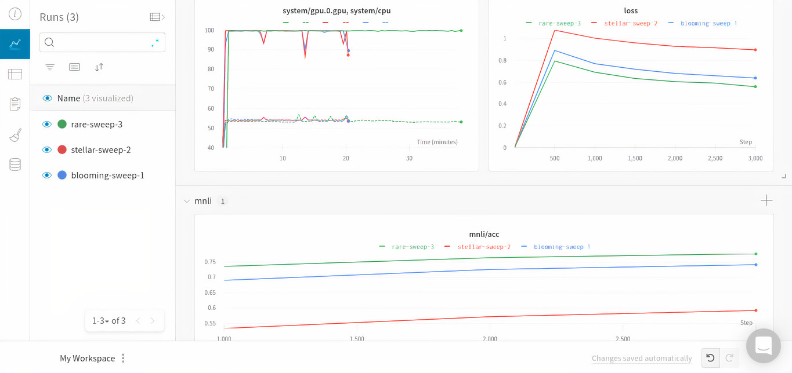

# The Ultimate Free Machine Learning Development Stack
### 4 tools, 0 dollars, everything you'll need

Keeping up with data science's intense pace of innovation is difficult for all of us. This problem is only compounded with the loss of a job, which comes with the loss of business problems to apply data science and machine learning to, the enterprise development tools utilized in order to do so, and the teammates to build solutions with. Job site Indeed has reported that data scientists have been the [most negatively](https://www.cnbc.com/2020/08/06/tech-hiring-slowdown-bad-sign-ahead-of-jobs-report.html) impacted positions within tech due to the coronavirus. However, the field continues to [progress](https://arxiv.org/abs/2005.14165). Regardless of your current professional situation, there's no such thing as staying still. If you are a machine learning developer or data scientist in the unfortunate position to have lost your job during the pandemic but are not working to improve your skills in these areas, you are absolutely getting passed by. I've spent the past 3 years helping data scientists and developers navigate the vast ecosystem of cloud and open source machine learning development tools, and wanted to recommend a workflow that enables end-to-end machine learning with a couple of services, all of which are free, to help keep skills sharp.

## Object Storage 
Object storage is critical to machine learning development, and provides a place to store training, test, and validation data sets as well as pretrained and fine-tuned models. It's also a huge revenue generator for cloud companies, as AWS' S3 is reported as its [most popular service](https://www.2ndwatch.com/blog/popular-aws-products-2018/), so finding free and unlimited cloud object storage is quite difficult, but not impossible. 

[Algorithmia](https://algorithmia.com/) is a serverless machine learning deployment platform (more on deploying models below). There are a number of utilities that Algorithmia provides in order to facilitate the deployment of models, including free object storage. According to their [documentation](https://algorithmia.com/developers/data/hosted), "Algorithmia’s Data Sources make it easy to host your data files on the Algorithmia platform for free, while our Data API makes it a cinch to work with your hosted data." Their Data API is available in Python and has a getFile()/putFile() structure that makes it easy to download and upload data sets, models, and other utilities that may faciliate machine learning. Data collections can be made public, shared between teams, or private, and is free to store and access.

## Model Development and Training
There are a number of free, hosted Jupyter environments that can help in developing machine learning models. My favorite is [Google Colab](https://colab.research.google.com/). Colab only requires a Google account to use and provides free access to GPUs, even including NVIDIA V100's if you are lucky. It has very tight and very easy to use integrations with both GitHub and Weights and Biases (more on Weights and Biases later). I have prepared a [notebook](https://colab.research.google.com/github/PubChimps/opendatascience/blob/master/opendatascience.ipynb) hosted on Colab as an introduction to the service and others mentioned in this article. 

## Hyperparameter Optimization and Monitoring
Hyperparameter optimization allows developers to vary aspects of a model in order to tune its training performance. [Weights and Biases' Sweeps](https://docs.wandb.com/sweeps) automates HPO to explore a space of possible models. Sweeps provides a number of great features in addition to being a free service, including easy integration, early termination of poorly performing training sessions, and a variety of search strategies. Sweeps also decouples optimization from model training via their central sweep server, so multiple workers can iterate through a search space asynchronously and in parallel. Weights and Biases automatically logs model metrics as well, which can be used with or without hyperparameter optimization to monitor and visualize model training processes. Their monitoring allows easy tracking of machine learning projects in or to share or reproduce models and identify performant experiments. The monitoring is great in [Jupyter enviroments](https://docs.wandb.com/library/integrations/jupyter#additional-jupyter-features-in-w-and-b), providing benefits such as automatic authentication in Colab and saving code sequentially based on when a cell was run, not where it appears in a notebook.

|  | 
|:--:| 
| *Weights and Biases is a free tool that can manage hyperparameter optimizations and track model training metrics* |

## Model Libraries and Deployment
Model registries, repositories, and libraries help fast track end-to-end machine learning development by providing pretrained models and other utilites that can be fine-tuned towards a specific task. [Hugging Face's Transformers library](https://github.com/huggingface/transformers/) provides a great set of models and preprocessing tokenizers for use in natural language processing. State-of-the-art performance can be acheived in a number of NLP tasks with Transformers in as few as [two lines of code](https://huggingface.co/transformers/main_classes/pipelines.html), or completely customizable into larger machine learning pipelines with TFTrainer and PyTorch Lightening support.

Another great resource for using pretrained models is coming from the group already mentioned as a provider of free Object Storage, Algorithmia. They provide functionality to use deployed machine learning models, upload your own for inference, or to pipeline together in a fully managed, serverless environment that can be used across programming languages. Using deployed models on Algorithmia is not technically free, it costs 1 cent per 100 seconds of compute time, but accounts are given 5,000 free seconds of compute time a month, which I've found to be more than enough for personal use. 

## Summary
Algorithmia, Google Colab, Hugging Face's Transformers, and Weights and Biases can form a powerful combination in practicing end-to-end machine learning. A demonstration of all these tools working in concert can be found above in the model training and development section above as well as right [here](https://colab.research.google.com/github/PubChimps/opendatascience/blob/master/opendatascience.ipynb). If you have lost your job recently getting you skills out of data science obsolescence is just one component of a job search, and there are a number of resources that can provide assistance, including Open Data Science's very own [AI+](https://getaiplus.com/), which provides career services and job placement to Data Scientists and Engineers.
